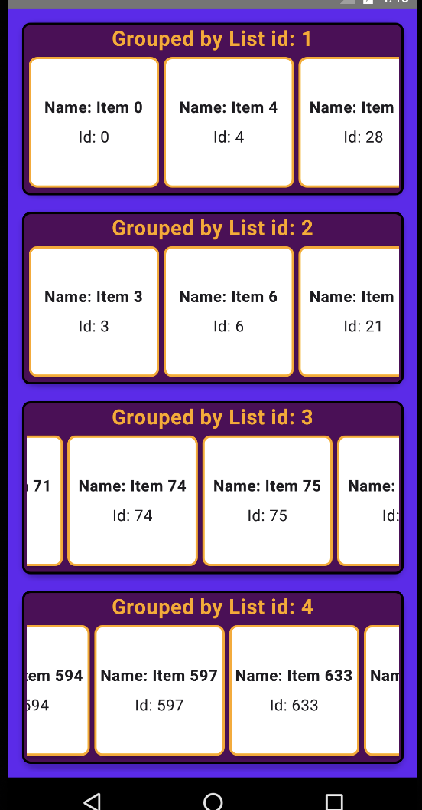
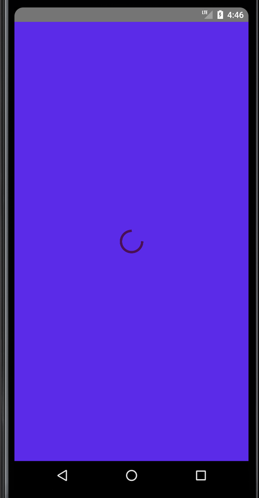
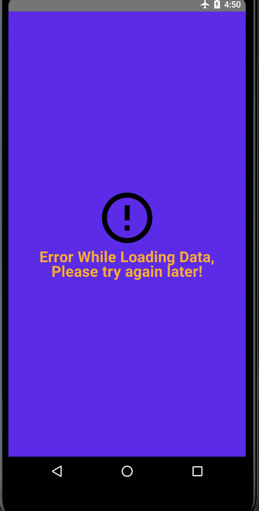

# Fetch Rewards Coding Exercise

An Android app that is written in kotlin that retrieves data from a url us MVVM architecture.

## Requirements
- [X] Display all items grouped by list
- [X] Sort the results by "listId" and then by "name"
- [X] Filter out any items where "name" is blank or null.

## Libraries in Use
- Kotlin Coroutines
    - Simplify asynchronous programming by providing a more concise and readable way to handle background tasks without blocking the main thread
- Hilt
    - Comprehensible dependency injection library, making it easier to manage and provide dependencies, improve code modularity, and enhance testability with less boilerplate code.
- Retrofit
    - Easily manage HTTP requests and responses, transforming them into Kotlin objects for smooth and efficient network operations.
- LiveData
    -  Build reactive and data-driven user interfaces, enabling automatic updates of UI components when underlying data changes, while also managing lifecycle awareness to prevent memory leaks and crashes.
- RecyclerView
    - Efficiently display large sets of data in a list or grid format, providing dynamic and smooth scrolling performance while optimizing memory usage by recycling views.
- Moshi
    - Serialize Kotlin objects to JSON and vice versa, simplifying the handling of JSON data from APIs by mapping it directly to Kotlin objects without manual parsing.
- OkHttp
  - HTTP client for Android  that supports connection pooling, HTTP/2, and transparent GZIP to handle requests and responses more reliably and faster.
- Compose
  -  UI toolkit that simplifies and accelerates UI development by using a declarative approach
- ViewModel
  - lifecycle-aware component designed to hold and manage UI-related data
- LazyRow
  - horizontally scrollable list that only renders the visible items

## Instructions
1) Clone Repository
2) Open project in Android Studios
3) Run app on any device on API level 24 or higher
4) Wait for Emulator Run
5) Scroll up and down with mouse to view clean and sorted list

### Alt View
1) Open device with API 24 or higher
2) Turn on Airplane mode
3) Run App

## Results
### Screenshots

#### MainScreen
 
#### LoadingScreen

#### ErrorScreen

### Video

## License
Copyright [2024] [Ulysis Llanes]

Licensed under the Apache License, Version 2.0 (the "License");
you may not use this file except in compliance with the License.
You may obtain a copy of the License at

       http://www.apache.org/licenses/LICENSE-2.0

Unless required by applicable law or agreed to in writing, software
distributed under the License is distributed on an "AS IS" BASIS,
WITHOUT WARRANTIES OR CONDITIONS OF ANY KIND, either express or implied.
See the License for the specific language governing permissions and
limitations under the License.